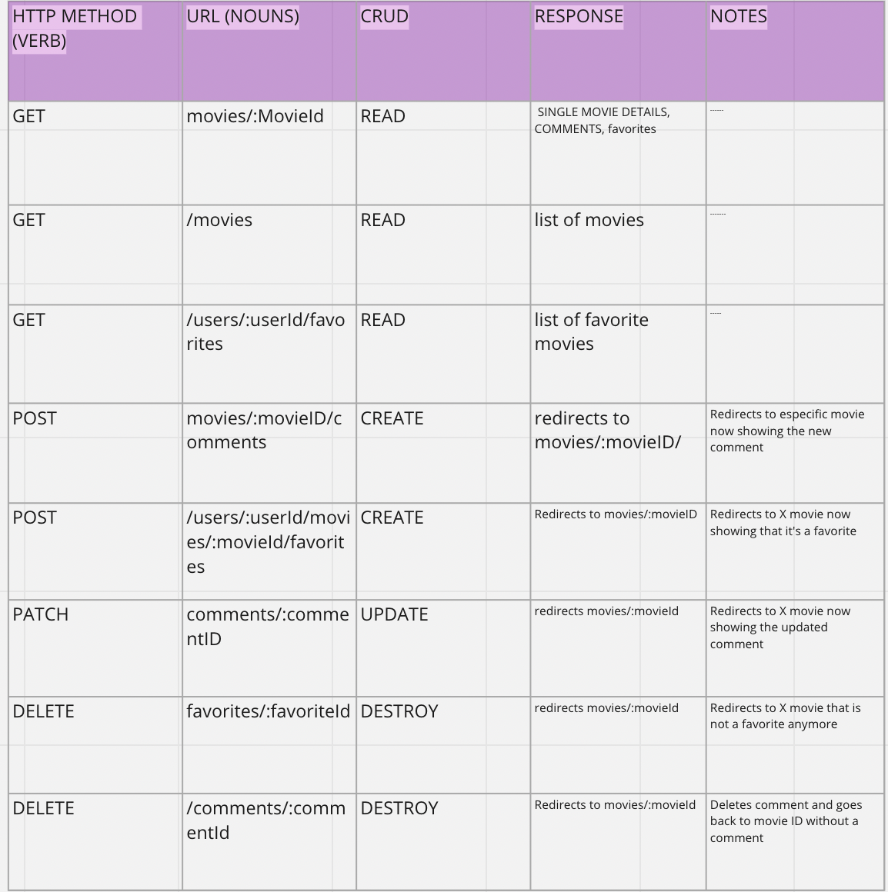
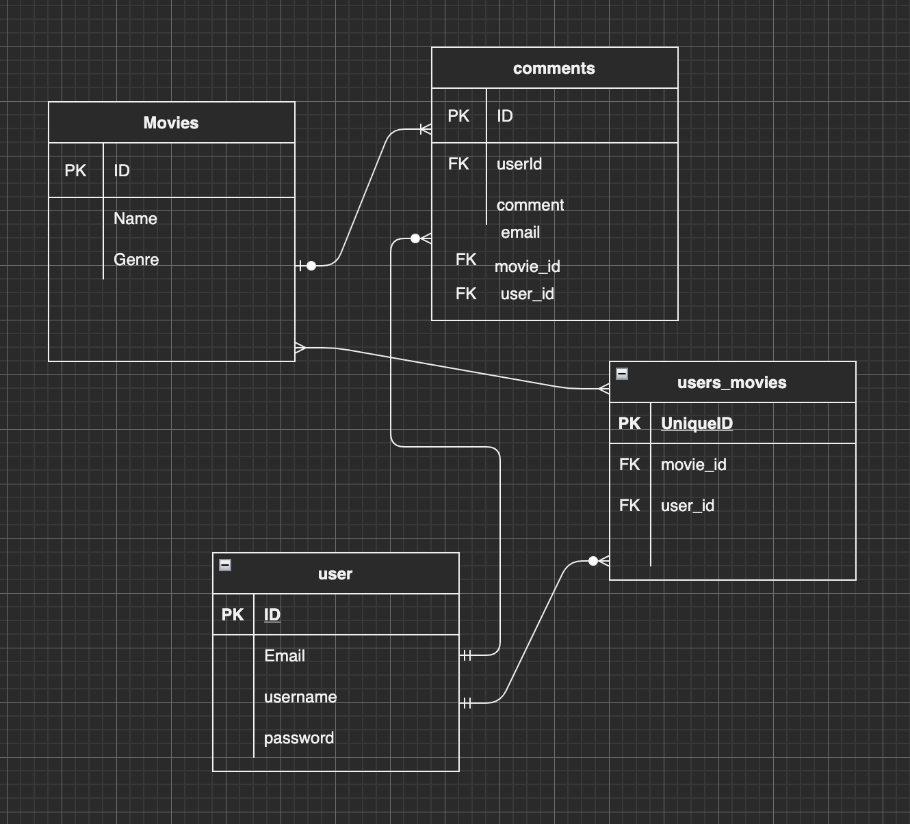
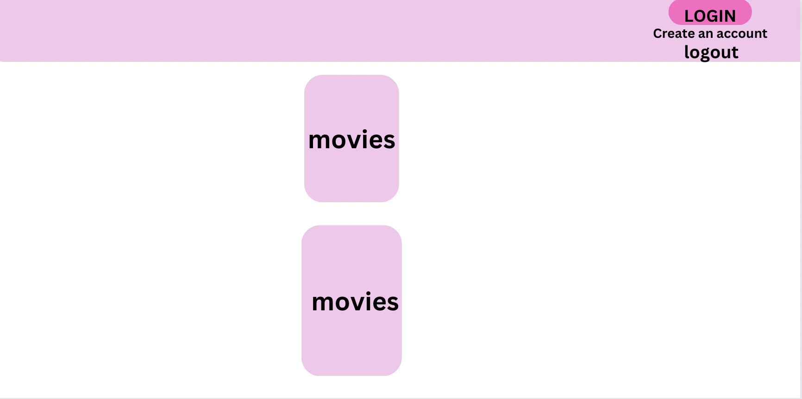
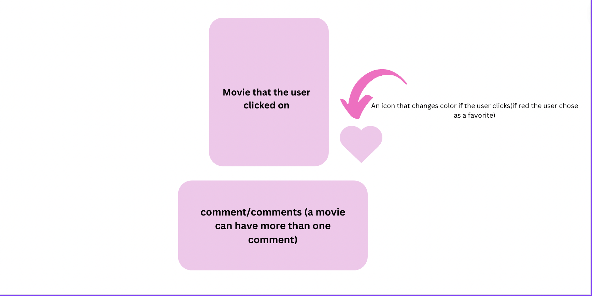
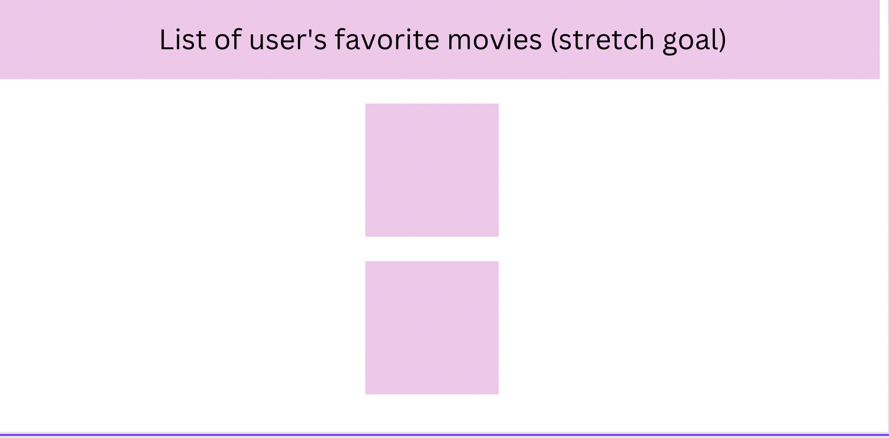

# Opinions of movies by non-experts

## Idea:
My unit2 project will be a movies website where users can create an account, login and comment their opinion of the movies displayed on the website. They will be able to edit and delete comments if they would like and choose their favorite movies. They will also be able to see other users comments.

## installation instructions:
* Fork and clone repository
* run (in your terminal): npm install (to instal necessary packages)
* Add files. In your terminal: touch .gitignore .env
* then you addnode_modules and .env to your .gitignore file
* Get an API key from OMDB api
* Create the database and migrate the models (commands:
sequelize db:migrate  )
* run nodemon in your terminal
* go to localhost:300
## API
I will be using the OMDB API. I have a key already.

## User Stories
As a user I would like to safely create an account, see different movies, be able to add my opinion of movies I've watched (as comments), edit or delete it if necessary, choose my favorites and see other users comments.

## MVP
* User can create account/login/logout
* User can see a variety of movies
* User can comment the movies they see
* User can edit comment
* User can delete comment
* User can choose their favorite movies

## Stretch Goals
* User can change their password
* User can rate movies from 1 start to 5
* User can access a page with all their favorite movies
* User can undo a favorite (if they chose a favorite movie by accident)

## Routes

## ERD

## Wireframes

## Aproach
My project has a table of users, comments and movies and also a joint table users_movies. I decided to do a findOrCreate for the comments, so the user could write a review in a movie that was not yet in the database.My routes were built in a way that the user could search for a movie, click in that specific movie to learn more details about it and be able to add a comment to it, edit and delete it (the last two I was not able to finish on time but I will tonight).

## technologies
* Node.js
* Express
* Ejs
* ORM for the db: Sequelize
* Postgres 
* CSS Bootstrap

## Post-Project Reflections:
I was able to learn a lot during this project. I now have a better understanding about node, express, sql and sequelize. I reviewed a lot of material to be able to put this app together, I have a much better understanding of restful routes, postgres and sequelize. I now feel comfortable working with a sequelize structured db, and feel comfortable working with APIs in an express app. I still want to add favorites

## Sources
* MDN

## link 
https://omdb-project.herokuapp.com/movies/tt3281548